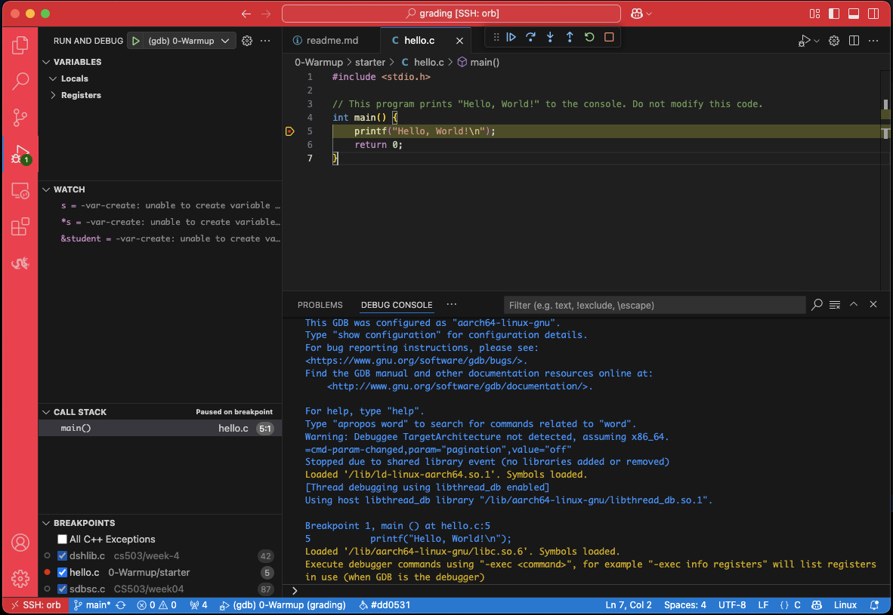

## Warmup Assignment

As mentioned in the course syllabus and in the first lecture this course will require you to use a linux environment for all of your assignments, and to maintain and submit your work in individual folders in a github.com respository that will be provided to you.

The platform options available for this course are:

- Drexel's tux cluster
- WSL on Windows
- Orbstack on MacOs
- Somthing else (vmware, parallels, native linux host, etc.)

The goal of this assignment is for you to decide which linux solution you will use and demonstrate that you can commit code to the provided github.com respository.

**Video Guide** - See TODO VIDEO GUIDE HERE

#### Directions

This assignment does NOT require you to write any code. The code in the starter folder is intended to help you validate your local environment, and demonstrate that you have correctly set up your github repository.

1. Clone your personal github repo. You received 3 emails related to github: 2 from me with instructions, and 1 from github.com inviting you to our student org. Use these email instructions to set up access and clone the repo. Also **check out the video guide first if you need help**.
2. Add the `0-Warmup` folder **to the root of your personal repo**. You must preserve all folder contents (starter, readme.md, questions.md, etc.). I strongly urge you to use VScode and [this Drexel extension](https://marketplace.visualstudio.com/items?itemName=bdlilley.drexel-cci) to manage your assignments. This makes it quick to set up an assignment, and ensures that you are maintaining the required folder structure. See "Drexel CCI Extension" below for more details.
3. Validate code runs - `cd 0-Warmup/starter` and `make test`. If you are missing any tools, the Drexel extension should have warned you and provided commands to install them.
4. You are not writing or changing any code. The goal is to see it run and print "Hello, world".
5. Answer the questions in questions.md.
6. Commit all your changes and push to your repo.
7. Submit the assignment in Blackboard under the "assignments" section. **The submission in Blackboard must be a link to your solution in your github.com repository; you must submit in Blackboard to signal that you are ready for an assignment to be graded**.

**Optional Extra Credit**

While optional, I HIGHLY encourage you to do this step. Many students struggle with complex code without ever debugging - I would like you to be comfortable with the debugger from day 1 - it will make your life easier!

If you use the [Drexel CCI extension](https://marketplace.visualstudio.com/items?itemName=bdlilley.drexel-cci), it automatically configures debugging for you for each assignment. You are of course free to configure debugging yourself if you are comfortable with how to do so.

Whether you use the extension or not, follow these steps for extra credit:

1. Set a break point on line 5 in `hello.c`, it should look something like this:

    

2. Run the debug profile for 0-Warmup so the breakpoint you set in the previous step will be hit.

3. Take a screenshot of your entire vscode window. It should clearly show an active debug session with the debugger stopped on line 5. Here is what it looks like on my system:

    

#### Drexel CCI Extension

The [Drexel CCI extension](https://marketplace.visualstudio.com/items?itemName=bdlilley.drexel-cci) was created to make assignment management easy. Here is how it works:

- You install the extension in vscode, which creates a new extension tab (the Drexel dragon icon)
- When you launch vscode or click on the extension, it does a system check to ensure you are running in a Linux environment and that you have the required tools installed.
  - If you do not have the requiremed tools, a warning popup will provide you the installation commands
- The extension lists all of the assignments available in our public assignment repo at https://github.com/drexel-systems/SysProg-Class/tree/main/assignments
- Clicking "pull" for an assignment does a couple important things:
  - Pulls the assignment code into your local vscode workspace (which should be your github.com private repo)
  - Adds debug configurations to `.vscode` for the assignment (it merges with other configs to support multiple assignments) - these debug files allow you to set breakpoints and use vscode's integrated debugger

#### About BATS

#### Submission Requirements

#### Grading

- 10 points: 0-Warmup code submitted 
- 10 points: Questions answered
- 10 points: EXTRA CREDIT demonstrate that you used gdb to debug hello.c by adding a screenshot of the active debug session to this folder

Total points achievable is 20/20.
